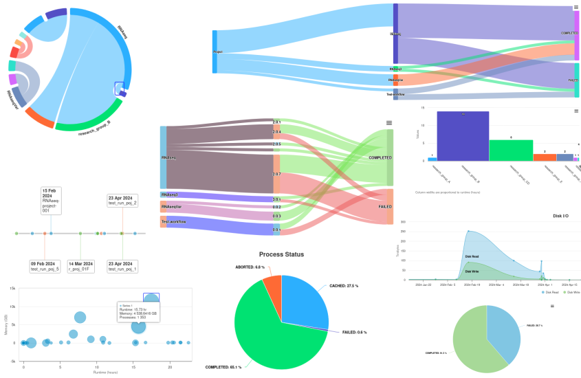

# Nextpie

Nextpie is a reporting tool for Nextflow workflows. It uses run metadata (trace files) produced by Nextflow, puts them in database and allows a user to perform aggregate analyses. The tool is build using Python Flask and design interface from AppSeed.

Nextpie comes with with a databased populated with sample data. Thus, user can [run it using docker](docs/deploy-docker.md) without a configuration need. This enable users to evaluate the tool without big setup/configuration hassle.

In case you decide to deploy Nextpie in a production environment please [clear the database](docs/db-clear-test-data.md) and add [SMTP](docs/config-email.md) details in email configuration (web interface >> Settings >> SMTP settings). 

> NOTE: With Nextpie >=0.0.2, Nextflow pipelines need [nf-nextpie](https://github.com/bishwaG/nf-nextpie) plugin (a client) to upload resource usage data to Nextpie. Nextpie users do not have to fiddle with their pipeline code anymore to integrate Nextpie. The data will be uploaded on the fly to Nextpie when a pipeline completes. The [example pipeline](docs/nextflow-workflow.md) provides more details on how to use the plugin.

## Requirements
Nextpie is tested in Python `v3.9` in Redhat Exterprise Linux 9 and Ubuntu 24.04 LTS. All the python packages in requirements files under the directory `requirements` have version enforcement. Thus, it should work with other Linux distributions as long as you are able to create a Python virtual environment using mentioned version of Python packages. 

#### Minimal requirements
* Linux operating system
* Python == 3.9 (with Python virtual environment)
* Nextflow >=24.10.4

#### Optional requirements
* Conda
* Guix
* Docker
* Gunicorn

## User manual
Nextpie can be run inside varities of software environments. Use one of the following suitable environments to deploy Nextpie.

* #### Deployment
    - [Python virtual environment](docs/deploy-python.md) (development environment) [[Instructon video](https://youtu.be/HJSIUa0EsD0)]
    - [Conda environment](docs/deploy-conda.md) [[Instructon video](https://youtu.be/-2Af_aU4vmM)]
    - [Guix environment](docs/deploy-guix.md)
    - [Docker](docs/deploy-docker.md) [[Instructon video](https://youtu.be/kmLNcgQN33I)]
    - [Gunicorn](docs/deploy-gunicorn.md)
    - [Waitress](docs/deploy-waitress.md) (Windows)

* #### Configurations
    - [Email](docs/config-email.md)
    - [Integrating Nextpie into Nextflow workflow](docs/configure.md)

* #### [Remove test data from the database](docs/db-clear-test-data.md)
* #### [Backup (dump) Nextpie's database (SQLite)](docs/db-dump.md)

* #### [Running an example Nextflow workflow](docs/nextflow-workflow.md) [[demo video](https://youtu.be/ZrnkrdmcLv0)]
* #### [Nextpie API](docs/api.md)
* #### [Admin page](docs/admin.md)

## Demo videos
* [Nextpie webUI overview](#)
* [Generating plots using webUI](https://youtu.be/CrL1GM2gCLs)
* [Uploading trace file manually](#)
