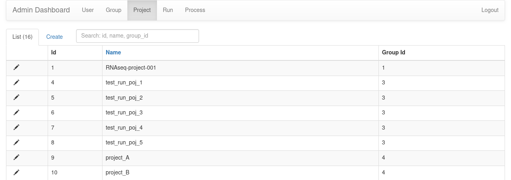

## Admin GUI

Nextpie has an administrator view for modifing cetrain database entries. It can be accessed via [http://127.0.0.1:5000/admin](http://127.0.0.1:5000/admin). The URL is not explicitly mentioned anywhere in Nextpie. Thus, an administrator should type the URL in a address bar of a web browser to access it. Any user having superuser (database table user, field super_user) access can the interface. Nextpie has default administrator user `admin` which can not be deleted via the interface. 

> Note: The base URL could be different if you have hosted Nextpie in a production environment with a domain name or public IP address. 
