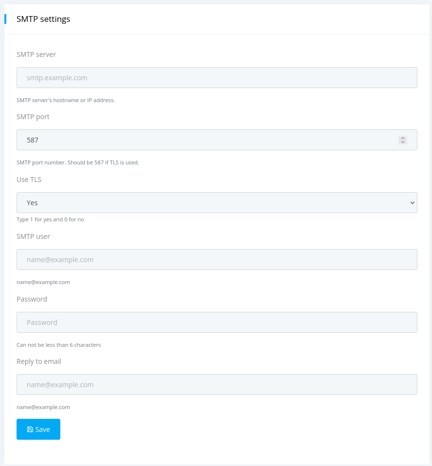

## Email configuration

The default administrator account (admin) can update the SMTP settings from the Settings page.

To configure SMTP: 

#### ✅ Step 1. 
Log in to the Nextpie web interface ([http://127.0.0.1:5000/](http://127.0.0.1:5000/)) using the default credentials:

- **Username:** admin
- **Password:** admin

#### ✅ Step 2. 
Navigate to the Settings page to update the SMTP configuration.

#### ✅ Step 3. 
At the same time, update the default email address admin@example.com associated with the admin account.

> ⚠️NOTE: To use Gmail as your SMTP provider, you must create an App Password. Please follow [Google's instruction](https://support.google.com/mail/answer/185833?hl=en) to generate one for your Gmail account.

> ⚠️ NOTE: Without valid SMTP configuration, Nextpie will not be able to send password recovery emails.
