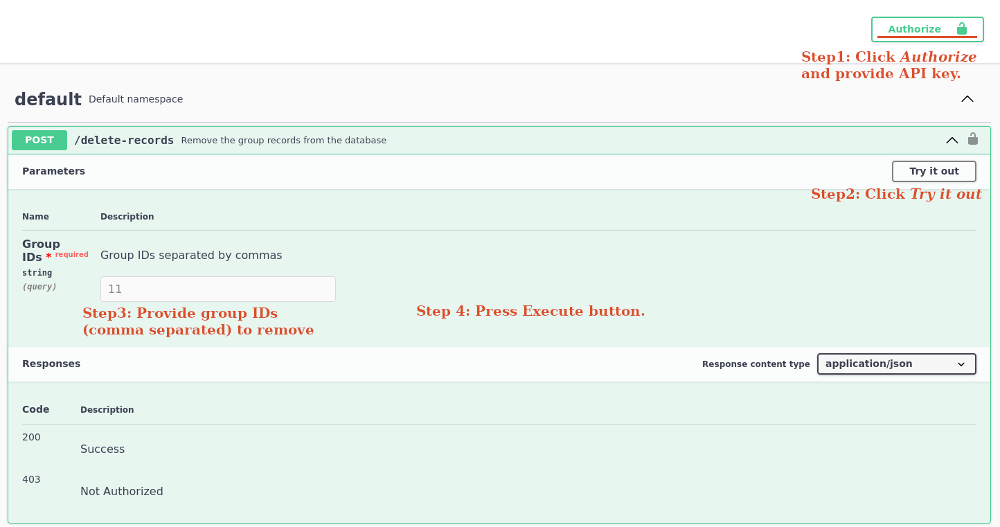

# 🧹 Removing the test data from the database

If you want to remove test data, there are three available options:

- Via the API  
- By replacing the default SQLite database file  
- By removing test records using the Flask command-line interface  

## Removing records using the API

To delete all records associated with specific groups, you can provide comma-separated group IDs using the `/delete-records` API endpoint at `http://127.0.0.1:5000/api/v1.0`. This method can be used for more than just test the data removal.



⚠️ Ensure that you have deployed Nextpie and that it is running.

### ✅ Step 1:

- Go to [http://127.0.0.1:5000/api/v1.0](http://127.0.0.1:5000/api/v1.0)  
- Click the **Authorize** button and provide the default API key `jWCr-uqJB9fO9s1Lj2QiydXs4fFY2M`, unless you have created a new API key through Nextpie's web interface. A newly created API key will always overwrite the previous one.

### ✅ Step 2:

- Click the **Default namespace** and expand it.  
- Click **/delete-records** and expand it.  
- Click the **Try it out** button. This will enable the **GroupID** text field and reveal the **Execute** button.

### ✅ Step 3:

- Enter the comma-separated group IDs you wish to remove. To remove only test data, enter the following group IDs: `1,2,3,4,5,6,7,8,10,11`. You can easily obtain group IDs from Nextpie's web interface under **Database >> Group**.

### ✅ Step 4:

- Press the **Execute** button.

⚠️This will remove all related records (projects, runs, and processes) for the specified groups from the database.

## Replacing the default SQLite database

> ⚠️ **Note:** This method does not work if you have deployed Nextpie as a Docker container.

The Nextpie repository includes an alternate SQLite database file: `assets/db-wo-test-data.sqlite3`. This database contains no records in the Group, Project, Run, or Process tables. The simplest way to remove test data is to replace `db.sqlite3` with `assets/db-wo-test-data.sqlite3`. Alternatively, you can modify the database path in `config.py` by updating the `SQLALCHEMY_DATABASE_URI` value as follows:

```python
SQLALCHEMY_DATABASE_URI = 'sqlite:///' + os.path.join(basedir, 'assets', 'db-wo-test-data.sqlite3')
```

## Removing records using Flask CLI

> ⚠️ **Note:** This method does not work if you have deployed Nextpie as a Docker container.

### ✅ Step 1: 
If you already have a [Python virtual environment](deploy-python.md) in the Nextpie root directory, you can skip this step. Otherwise, create and activate a virtual environment via the terminal:

```bash
# Create a virtual environment (Unix)
python3.9 -m venv env 
source env/bin/activate
```

### ✅ Step 2:
Next, change to the Nextpie directory and run the following command to view help options:

```bash
flask clear --help
```

```
Usage: flask clear [OPTIONS]

  Remove test data from the database.

Options:
  -g, --gid TEXT  Group IDs (separated by commas) to remove.  [required]
  --help          Show this message and exit.
```

### ✅ Step 3:
Provide the comma-separated group IDs from the `Group` table to remove all records linked to them:

```bash
flask clear --gid 1,2,3,4,5,6,7,8,10,11
```
> NOTE: This method can be used for more than just the test data removal.

